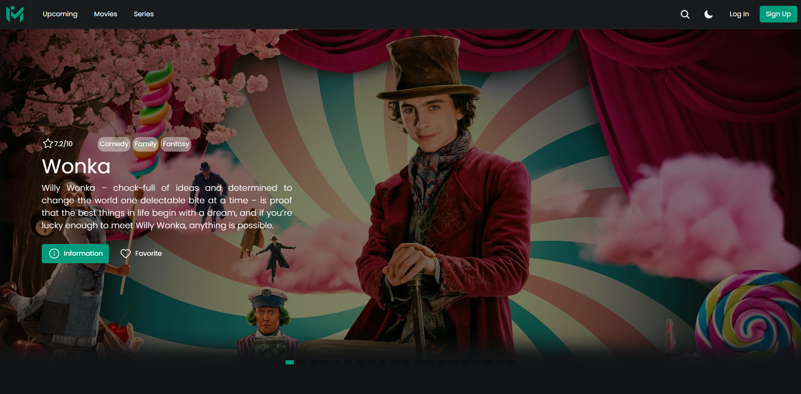
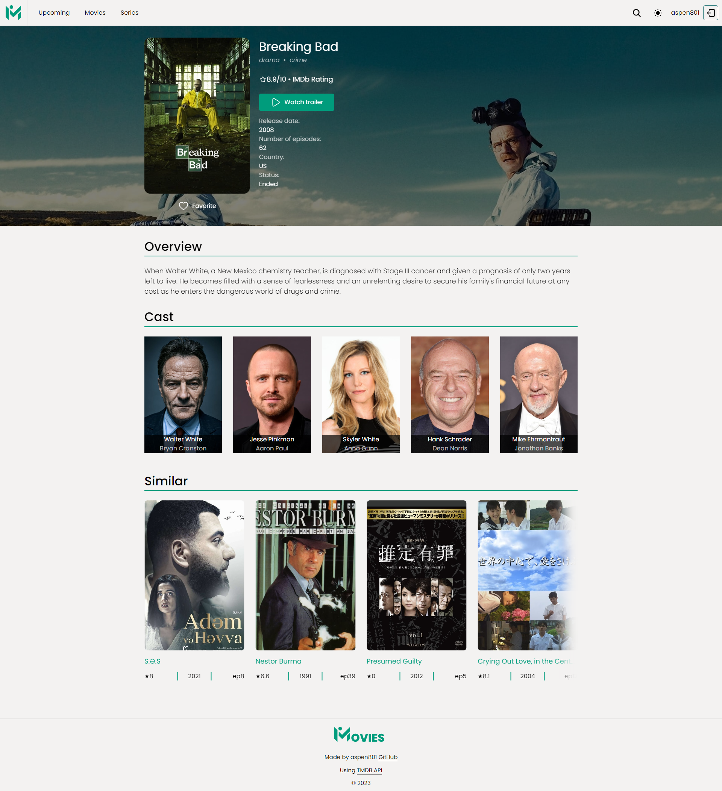
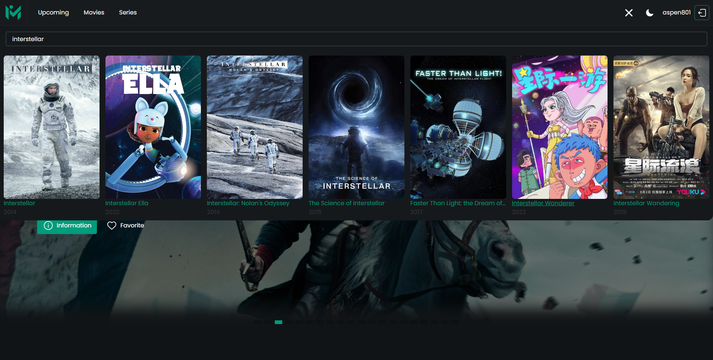
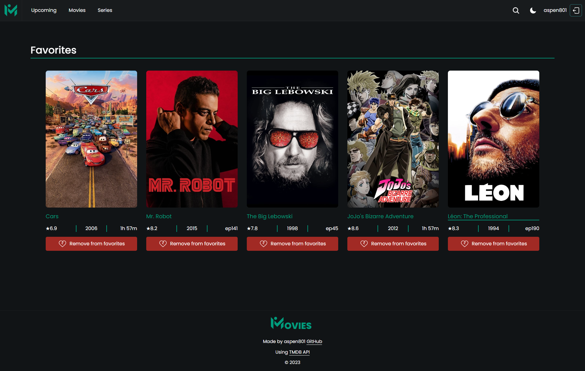

# Movie Explorer

⚡️[Live Demo](https://aspen-movie-app.netlify.app/)

**Movie Explorer** is a React-based web application that allows users to explore information about movies sourced from the TMDb API. The application utilizes various technologies such as React, Redux Toolkit, SCSS for styling, Firebase Authentication, and Firebase Realtime Database for backend functionality.

## ⚙️Technologies Used

- **React**: A JavaScript library for building user interfaces.
- **Redux Toolkit**: A state management library for React applications.
- **SCSS**: A CSS preprocessor that enhances the maintainability and readability of stylesheets.
- **Firebase Authentication**: Provides secure authentication methods for user sign-up and login.
- **Firebase Realtime Database**: A NoSQL cloud database to store and sync data in real-time.

### 💠Additional Libraries

- **Formik with Yup**: Used for form management and validation to enhance the user experience.
- **Swiper**: A modern touch slider for mobile apps and websites, employed for interactive content presentation.

## 📝Features

### 🔒Authentication
- Users can sign up and log in securely using Firebase Authentication.
- Authenticated users have access to personalized features.
  

### 🎥Movie/TV Show Details
- Explore trending, now in theaters, popular, and top-rated movies and TV shows on the homepage.
- Dedicated pages for upcoming movie premieres.
- View detailed information about a specific movie or TV show on its dedicated page.
- Browse similar recommended movies or TV shows on the details page.

  
  

### 🔎Global Search
- Utilize a global search feature to find movies or TV shows across the entire site.

  
  

### ❤️Favorites
- Authenticated users can add movies or TV shows to their favorites list for quick access.
 
  
  

### 🌚🌝Theme Switching
- Toggle between light and dark themes for a personalized viewing experience.

# Screenshots

  
